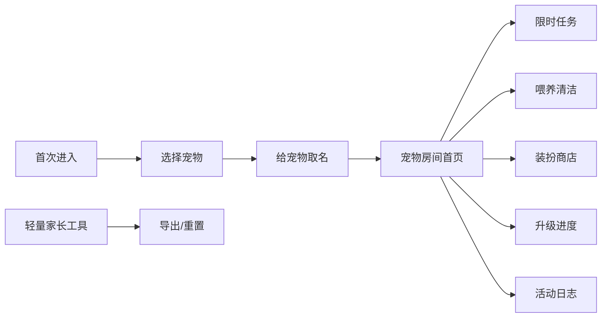

# 星星云宠物网页版设计规格

状态：MVP Implemented  
日期：2026-06-21  

## 设计目标

- 孩子第一次打开后先选择宠物、给宠物取名，再进入宠物房间。
- 孩子在首页就能完成完整循环：开始任务、输入实际用时、获得能量、喂养清洁、购买并穿戴装扮。
- 家长工具退到首页底部，第一版只保留导出与重新开始。
- 所有反馈都是正向陪伴，不制造“宠物被伤害”的压力。
- 移动端优先，桌面端保持更宽松的信息布局。

## 信息架构

## 页面规格

### 首次进入

- 主要元素：三个宠物选项、昵称输入、宠物名输入、开始按钮。
- 目标：孩子能在 30 秒内完成选择，并建立“这是我的宠物”的归属感。
- 反馈：选中宠物后卡片高亮，按钮文案清晰，输入框有可见标签。

### 宠物房间首页

- 主要元素：宠物 SVG 房间、可用能量、宠物状态、饱饱值、清洁值、开心值。
- 升级展示：当前形态、累计能量、活跃天数、下一形态门槛。
- 即时反馈：完成任务、喂养、清洁、穿戴后展示顶部反馈条，并写入活动日志。

### 限时任务

- 主要元素：任务卡、目标用时输入、开始按钮、实际用时输入、完成按钮。
- 奖励规则：按任务基础能量发放；准时完成得基础能量；提前完成有小幅加成；超时完成仍有温和奖励。
- 约束：反馈不使用羞辱、威胁、宠物受伤、死亡或生病类表达。

### 照顾与装扮

- 商品分组：喂养、清洁、装扮。
- 喂养和清洁是消耗品，提升饱饱值、清洁值和开心值。
- 装扮购买后可长期穿戴，宠物插画立即变化。
- 可用能量不足时按钮禁用，并保留当前布局稳定。

### 轻量家长工具

- 位置：页面底部。
- 操作：导出本地 JSON、重新开始。
- 不在 v0.3 首页放任务管理后台，避免压过孩子体验。

## 视觉系统

- 主色：深墨色、稳定蓝。
- 辅色：薄荷绿、星星金、柔和珊瑚、少量薰衣草。
- 卡片圆角：8px。
- 任务按钮和图标按钮保持稳定尺寸，避免布局跳动。
- SVG 宠物资产在 MVP 中内嵌，避免外链加载失败。

## 可访问性

- 页面语言为 `zh-CN`。
- 主导航使用原生 button。
- 图标按钮有 `aria-label`。
- 状态提示使用 `aria-live`。
- 提供 skip link。
- 已通过 Playwright + axe 桌面/移动扫描。
