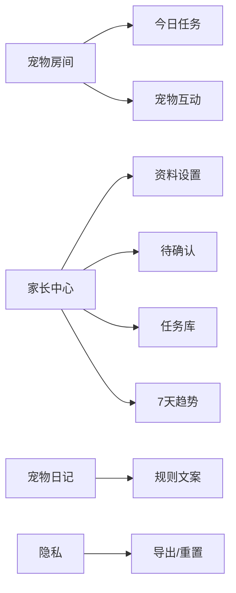

# 星星云宠物网页版设计规格

状态：MVP Implemented  
日期：2026-06-21  

## 设计目标

- 孩子打开后先看到宠物房间和今日小目标。
- 家长能在 2 分钟内完成确认、加任务、导出或重置。
- 所有反馈都是正向陪伴，不制造“宠物被伤害”的压力。
- 移动端优先，桌面端保持更宽松的信息布局。

## 信息架构

## 页面规格

### 宠物房间

- 主要元素：宠物 SVG 房间、宠物状态、成长能量、今日任务。
- 任务状态：未完成、待确认、已收下。
- 主要操作：完成任务、撤回任务、和宠物互动。

### 家长中心

- 资料设置：孩子昵称、宠物名。
- 待确认：统一确认需要家长审核的任务。
- 7 天趋势：按天展示成长能量。
- 任务库：添加、编辑名称、上移、下移、停用。
- 数据控制：导出 JSON、清空本机数据。

### 宠物日记

- 文案类型：鼓励、故事、总结、提醒。
- 日志对家长可见，来源标记为规则模板。

### 隐私页

- 呈现本地保存、不采集、可控制、可审计四类安全承诺。
- 提供导出和重新开始入口。

## 视觉系统

- 主色：深墨色、稳定蓝。
- 辅色：薄荷绿、星星金、柔和珊瑚、少量薰衣草。
- 卡片圆角：8px。
- 任务按钮和图标按钮保持稳定尺寸，避免布局跳动。
- SVG 宠物资产在 MVP 中内嵌，避免外链加载失败。

## 可访问性

- 页面语言为 `zh-CN`。
- 主导航使用原生 button。
- 图标按钮有 `aria-label`。
- 状态提示使用 `aria-live`。
- 提供 skip link。
- 已通过 Playwright + axe 桌面/移动扫描。
