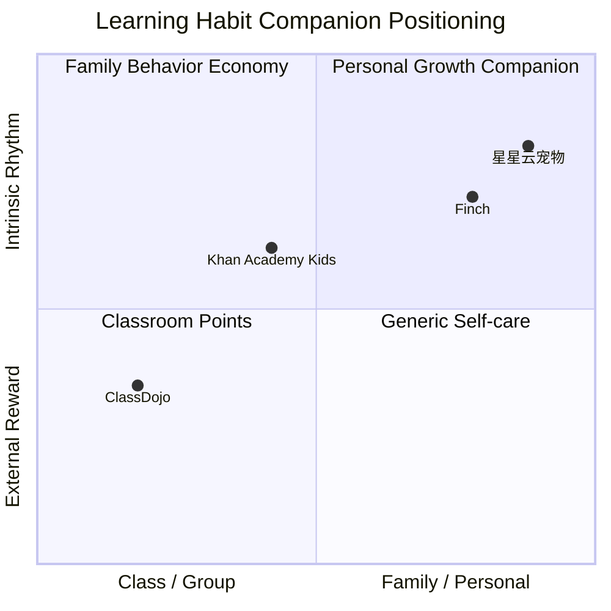

# 星星云宠物网页版产品调研简报

状态：Draft  
日期：2026-06-21  
路线：网页产品，不做微信小程序  

## 1. Executive Summary

星星云宠物网页版的机会不是再做一个“积分换宠物”的工具，而是做一个面向单个孩子和家庭的学习习惯伙伴。竞品验证了三个有效机制：即时正反馈、可成长的虚拟角色、家长/老师可配置任务；但家庭场景必须避开班级排行榜、扣分、抽奖、宠物挨饿/生病等压力机制。

MVP 应以“规则引擎 + 宠物成长 + 家长轻管理 + 儿童安全文案”为核心。AI 不进入自由聊天和评分决策，只能作为可审计的鼓励语、总结、故事生成层，且默认可关闭。

## 2. Research Scope

| 项目 | 内容 |
| --- | --- |
| 目标用户 | 小学生孩子、家长 |
| 使用场景 | 家庭作业、阅读、背诵、整理、复盘、每日习惯 |
| 交付形态 | 手机优先响应式网页，后续可 PWA |
| 非目标 | 微信小程序、班级管理、老师端、排行榜、公开社交、抽奖经济 |
| 证据等级 | Desk research + 用户需求假设；尚未做家庭访谈和可用性测试 |

## 3. Sources Reviewed

| Source | Type | Relevance | Confidence |
| --- | --- | --- | --- |
| 虎嗅文章《小学生在班级里云养宠》 | 新闻/市场观察 | 说明“班级积分 + 云宠物”在小学生场景中的吸引力和风险 | Medium |
| ClassDojo Points | 竞品/行为反馈 | 官方强调用 Points 记录和庆祝学生成功，可自定义技能 | High |
| Finch | 竞品/自我照顾宠物 | “照顾自己即照顾宠物”的闭环适合改造为“学习习惯即陪宠物成长” | High |
| Khan Academy Kids | 儿童学习产品 | 学习内容、角色、奖励和房间收藏验证儿童友好学习体验 | High |
| CAC《儿童个人信息网络保护规定》 | 合规 | 中国境内不满 14 周岁儿童信息处理规则 | High |
| FTC COPPA | 合规 | 美国 13 岁以下儿童在线隐私规则参考 | High |
| UNICEF AI for Children | 儿童 AI 原则 | AI 功能需要儿童权利、安全、可解释和监护人控制 | High |

参考链接：
- https://www.huxiu.com/article/4849006.html
- https://www.classdojo.com/points/
- https://finchcare.com/
- https://www.khanacademy.org/kids
- https://www.cac.gov.cn/2019-08/23/c_1124913903.htm
- https://www.ftc.gov/business-guidance/privacy-security/childrens-privacy
- https://www.unicef.org/innocenti/reports/policy-guidance-ai-children

## 4. Competitive Analysis

### Feature Matrix

| Capability | 星星云宠物 MVP | ClassDojo | Finch | Khan Academy Kids |
| --- | --- | --- | --- | --- |
| 单孩家庭学习习惯 | Full | Partial | Partial | Partial |
| 虚拟宠物成长 | Full | Partial | Full | Partial |
| 家长任务配置 | Full | Partial | Partial | Partial |
| 儿童学习内容库 | None | None | None | Full |
| 班级/老师管理 | None | Full | None | Partial |
| 积分/奖励 | Full | Full | Full | Full |
| 排行榜/竞争 | None | Partial | None | None |
| 自由聊天 AI | None | Unknown | Unknown | None |
| 隐私/家长控制 | Full target | Full target | Partial | Full target |

### Positioning Map

X 轴：课堂/群体管理 → 家庭/个人陪伴  
Y 轴：外部奖惩 → 内在节奏支持

## 5. Strategic Implications

- 差异化必须来自“只服务一个孩子的长期关系”，而不是更多任务类型。
- 宠物不能被设计成孩子的道德负担；未完成只应触发“休息、明天继续、挑一个小目标”，不触发惩罚叙事。
- 家长端必须轻：每天配置/确认不超过 2 分钟，否则会断用。
- 第一版不做内容学习库，避免和 Khan Academy Kids 类产品正面竞争；只做习惯闭环和家庭陪伴。
- AI 必须是可关闭、可审计、可替换的文案层；不得决定奖励、评价孩子人格，或进行心理/医疗建议。

## 6. Research Gaps

- 需要和女儿做 3 次观察式可用性测试：首次打开、完成任务、第二天回访。
- 需要家长端实际操作计时，验证是否低于 2 分钟。
- 需要验证宠物形象偏好：云朵、星星、小兽、鸟类、植物哪种更有亲近感。
- 需要验证“成长能量”是否比“积分/金币/食物”更少压力。
