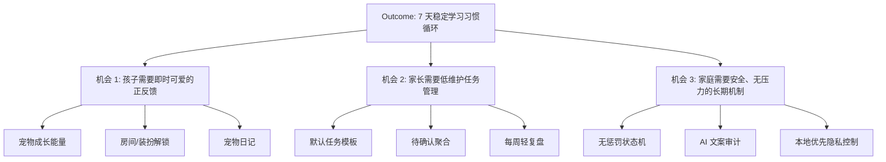

# Problem, Opportunity, and MVP Prioritization

状态：Draft  
日期：2026-06-21  

## Problem Statement

家庭学习习惯培养经常依赖家长提醒、口头催促和短期奖励，容易变成亲子摩擦。孩子完成任务后缺少即时、温和、可持续的反馈；家长则缺少一个维护成本低、隐私可控、不会制造比较和焦虑的工具。

### User Impact

| Segment | Impact |
| --- | --- |
| 小学生孩子 | 学习任务抽象、反馈延迟、容易觉得只是被监督 |
| 家长 | 每天重复提醒，难以知道哪些习惯真的稳定下来 |

### Success Criteria

| Metric | Baseline | Target | Timeline |
| --- | --- | --- | --- |
| 7 日家庭试用留存 | Unknown | 5/7 天孩子愿意打开 | 首轮家庭试用 |
| 家长每日维护时间 | Unknown | P75 <= 2 分钟 | 首轮家庭试用 |
| 首次打卡完成率 | Unknown | >= 80% | 10 个家庭样本后 |
| 负面情绪反馈 | Unknown | 0 个因宠物压力导致的明显焦虑案例 | 持续 |

## Opportunity Solution Tree

**Desired outcome:** 孩子愿意连续 7 天主动或半主动完成至少 1 个学习习惯任务，家长每日维护时间不超过 2 分钟。

## Candidate MVP Items

| Item | Description | User value | Risk |
| --- | --- | --- | --- |
| Default onboarding | 家长 2 步创建孩子、宠物、默认任务 | 快速开始 | 默认不合适会降低信任 |
| Daily task board | 孩子看到今日 1-3 个任务并打卡 | 清楚知道做什么 | 任务过多造成压力 |
| Pet state engine | 根据完成情况生成宠物阶段/心情 | 即时反馈 | 状态文案必须安全 |
| Parent review center | 家长确认、撤销、调整任务 | 低维护 | 过于复杂会弃用 |
| Pet diary | 自动生成今日/本周温和总结 | 家庭沟通 | AI/文案必须可控 |
| Local-first data | 默认本地存储，可导出删除 | 隐私安全 | 多设备同步缺失 |
| Stable web deployment | 可分享的 HTTPS 预览/正式链接 | 真正可体验 | 需要部署配置 |

## Prioritization

### MoSCoW

| Item | Bucket | Rationale | Risk if dropped |
| --- | --- | --- | --- |
| Default onboarding | Must | 没有启动流就不能试用 | 家长无法开始 |
| Daily task board | Must | 核心行为入口 | 没有习惯闭环 |
| Pet state engine | Must | 产品差异化核心 | 退化为普通待办 |
| Parent review center | Must | 家庭使用必需 | 家长不可控 |
| Local-first data | Must | 儿童隐私门槛 | 合规和信任风险 |
| Pet diary | Should | 增强情感连接 | 留存弱 |
| Stable web deployment | Must | 替代小程序二维码 | 无法验收 |
| AI 文案生成 | Could | 可先规则模板 | AI 风险可延后 |
| 多孩子/多家长 | Won't | 第一版家庭单孩 | 范围膨胀 |
| 排行榜/商城/抽奖 | Won't | 与产品原则冲突 | 压力和上瘾风险 |

### ICE

| Item | Impact | Confidence | Ease | Score |
| --- | ---: | ---: | ---: | ---: |
| Daily task board | 10 | 8 | 8 | 640 |
| Pet state engine | 10 | 7 | 7 | 490 |
| Default onboarding | 8 | 7 | 8 | 448 |
| Local-first data | 8 | 8 | 7 | 448 |
| Parent review center | 8 | 7 | 6 | 336 |
| Stable web deployment | 9 | 8 | 4 | 288 |
| Pet diary | 6 | 6 | 7 | 252 |
| AI 文案生成 | 5 | 4 | 4 | 80 |

## MVP Recommendation

第一版只做：默认 onboarding、今日任务、宠物成长状态、家长中心、本地数据控制、宠物日记的规则模板版、稳定部署链接。AI 自由聊天、多孩子、商城、排行榜、学习内容库全部排除。

## Limitations

当前排序主要基于 desk research 和产品判断，缺少真实家庭访谈。Kano 排序不适用，需后续用孩子/家长反馈补充。
